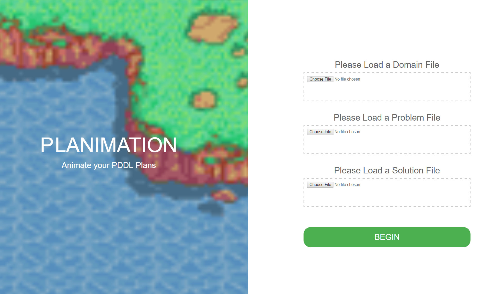
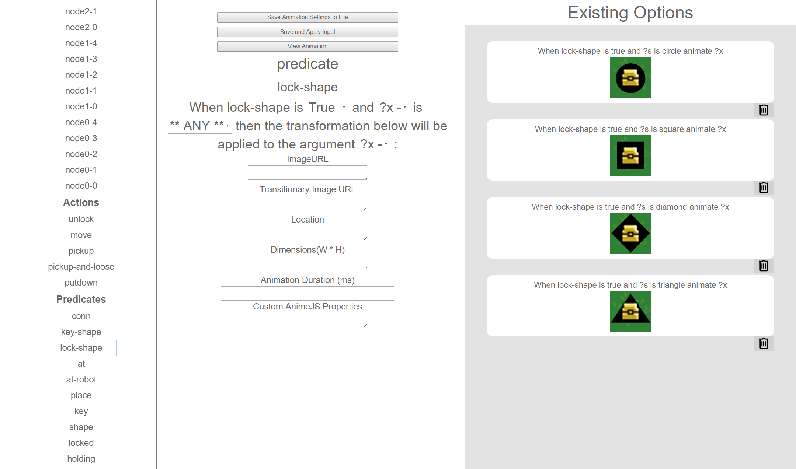

# Planimation


A tool to animate plans generated from PDDL definitions.

## Usage
If you would like to play along at home, run a http-server from the root of the Planimation project directory and use the files in SampleProblems/BlocksWorld

First a user loads their valid PDDL domain and problem files as well as a properly formatted text file containing the plan, at the input screen pictured below.

## 
The text file containing the plan must resemble the example below. Specifically, it must not contain extraneous information contained in braces as the parser will attempt to interpret this as an action in the plan and either fail completely or corrupt part of the animation timeline.

```
Found Plan (output)
(unstack c e)
(stack c f)
(unstack p j)
(put-down e)
```
Note: the newlines and the contents of the first line above are not necessary.

Once a user clicks ‘Begin’, these files are passed to the relevant parsing functions and the required entities are returned as JavaScript objects. The user is then taken to the input specification page.

## 
The input page is separated into three sections. From left to right, these are the input selector section, the input specification section and the input preview section.

###The Input Selector Section
The input selector section is the menu from which the user selects the entity they want to attach a visual specification to. It also contains two additional entries, Load Options, to load a saved specification, and Global Options, used to set parameters relevant to the stage used to display the animation.

###The Input Specification Section
Based on the entity selected in the input selector, a form is generated and placed here. The structure of these forms is detailed below.

####Global Options
Here users set the units that will be used for all sizing and location inputs (Percent or Pixels). The user can then specify whether to label images of objects with their names, and any additional options they would like to apply to the stage via CSS (such as a background image, for example).

####Object Options
A user can set the location of the image used to represent an object, the object’s initial location and dimensions in the units specified in the global options.

A Note about dimensions: Dimensions set the size of the div containing an objects image. By default, the image is set to 'cover' the container div. This means the image maintains its proportions, but will not scale larger than its resolution. I'm open to feedback on whether users think this is a good approach or an annoying caveat that should be easy to change.

Planimation also allows users to specify a relative location for an object using the following syntax:

```
on:x    ;;  current object is placed at the same coordinates as x
above:x ;;  current object is placed above object x
below:x
left:x
right:x
```
Users are also able to specify any custom CSS they would like to apply to the object’s visualisation by default, for example a user could set fonts and sizes thereby styling the object’s label, if labels are enabled in the global options.

####Action Options
A user can set the ordering of predicate animations associated with an action’s postconditions.
NOTE: These are not yet implemented, and I'm still debating whether they're useful.

####Predicate Options


Predicate options require a user to specify when the defined visualisations will apply. Their inputs are then applied from most general to most specific in a given scenario, with conflicting inputs being overwritten in favour of the most specific applicable option.

Where “**ANY**” appears in the image above, a user is able to select a specific object whose value the selected parameter can take. The specified visual inputs are then applied to the object passed to the parameter specified only when the first parameter takes the chosen value. Of note is the fact that in the instance of a predicate option, a relative location input can refer not only to a specific object, but also any of the predicates parameters/arguments (as in 'above:?y' in the example above).

##Documentation
Please see the included jsdoc generated file in the /src folder

##Notes:
If you're looking for good images to use, I recommend openclipart.org.
Opengameart is another good resource.

Objects and Constants are treated the same

Inputs applied to Types, Objects and Constants are applied when the stage is created.

Inputs applied to Types apply to all object's of that type. If the object has its own inputs and there is a conflict, the object's inputs will override those
inferred from its type.

Inputs applied to predicates are applied when the scenario is matched and the target objects properties are updated. This occurs from loosest match to the tightest match (i.e options specified for a specific object override conflicts with those specified using the catchall **ANY**)

Postconditions can be animated all together based on the action, or in
sequence (this is configurable in Global Options).

These options are exportable/importable via JSON.

Using typed objects is recommended as it makes creating the initial stage much quicker, particularly when a problem has more than 10 or so objects/constants.

Sometimes if names are too long the input selector looks like it's blank. In fact you just need to scroll to find the text since it doesn't properly fit in the input selector div and hence the overflow becomes scrollable.
This should be fixed at some point.

If you get a parser error like "expecting LPAREN RPAREN got 1" it usually means the parser missed the EOF token for some reason. Adding a space to the end of the affected file seems to fix this.

##TODO
Still need to implement optional postcondition grouping/ordering:
The user should be able to choose whether to play all of an action's postcondition animations at once or sequentially, and if sequentially the user should be able to specify the order.

Maybe some input to rotate an image so that it's facing some degree. e.g box:120 would rotate the box 120 degrees clockwise from its default orientation.
